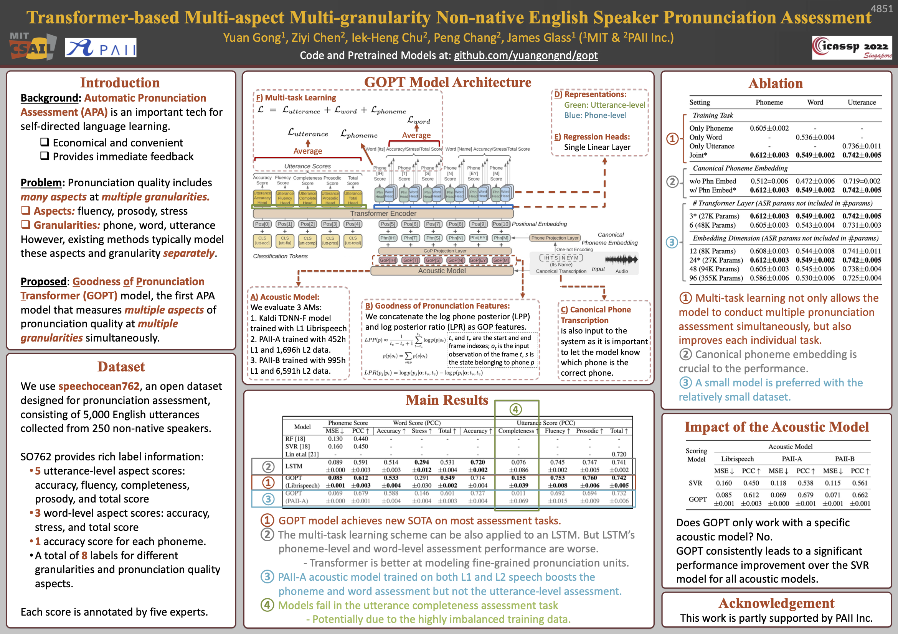

# GOPT: Multi-Aspect Multi-Granularity English Pronunciation Assessment System

> ⚠️ **For Setup: Use [START_LOCAL.md](START_LOCAL.md)**
> 
> This README contains information about the original GOPT research paper and model architecture.
> For setting up the system on a new machine (Windows, Docker, web interface), 
> please follow **[START_LOCAL.md](START_LOCAL.md)** which is verified against the actual codebase.
> 
> Known issues in this README: incorrect port numbers, outdated Kaldi workflow description, 
> references to non-existent files. See START_LOCAL.md for correct information.


A Transformer-based system for evaluating non-native English pronunciation. Given an audio recording and its transcript, it scores pronunciation across **multiple aspects** (accuracy, fluency, prosody, completeness) at **multiple granularities** (phoneme, word, utterance).

> **This is an enhanced fork** of the [original GOPT project](https://github.com/YuanGongND/gopt) by Yuan Gong et al. (MIT & PAII), originally published at ICASSP 2022. This fork adds a web interface, Docker deployment, Whisper ASR integration, automatic OOV handling, and more.

<p align="center"></p>

---

## Table of Contents

- [What's New in This Fork](#whats-new-in-this-fork)
- [Quick Start](#quick-start)
- [Usage](#usage)
  - [Web Interface](#1-web-interface)
  - [Docker Pipeline](#2-docker-pipeline-recommended)
  - [Python API](#3-python-api)
  - [Command Line](#4-command-line)
  - [REST API](#5-rest-api)
- [Training](#training)
- [Pretrained Models](#pretrained-models)
- [Project Structure](#project-structure)
- [Citation](#citation)
- [Contributors](#contributors)
- [License](#license)

---

## What's New in This Fork

| Feature | Description |
|---------|-------------|
| **Web Interface** | Browser-based UI with drag-and-drop audio upload, real-time processing, color-coded word-level feedback |
| **Docker Deployment** | Pre-configured container with Kaldi + all dependencies. No manual compilation needed |
| **Whisper ASR Integration** | Automatic speech-to-text transcription via OpenAI Whisper, no need to type transcripts manually |
| **Automatic OOV Handling** | Out-of-vocabulary words are automatically converted to phonemes using G2P (grapheme-to-phoneme) |
| **Long Audio Segmentation** | Automatically splits long recordings into processable segments |
| **REST API** | HTTP API for integration with other applications |
| **Multiple Audio Formats** | Supports WAV, MP3, M4A, FLAC, OGG and more (auto-converted to 16kHz mono WAV) |

---

## Quick Start

The easiest way to get started is Docker:

```bash
# 1. Build and start the container
docker-compose build
docker-compose up -d

# 2. Start the web interface
python web_server.py

# 3. Open http://localhost:8080 in your browser
```

See [DOCKER_USAGE.md](DOCKER_USAGE.md) for detailed instructions.

---

## Usage

### 1. Web Interface

The most user-friendly option. Upload audio, enter (or auto-transcribe) text, and get visual feedback.

```bash
# Make sure Docker container is running
docker-compose up -d

# Start the web server
python web_server.py
# Open http://localhost:8080
```

Results include:
- Sentence-level scores (accuracy, completeness, fluency, prosody, total)
- Word-level scores with color highlighting (green/yellow/red)
- Phoneme-level detail on click
- JSON export

### 2. Docker Pipeline (Recommended)

Process audio files through the command line with Docker:

```bash
# Start container
docker-compose up -d

# Process an audio file
docker exec -it gopt-pipeline /workspace/scripts/run_pipeline.sh \
  /workspace/audio_input/your_audio.wav \
  "THE TEXT TRANSCRIPT" \
  output_name
```

Results are saved to `audio_output/` as JSON.

### 3. Python API

```python
from inference_api import GOPTInference

gopt = GOPTInference(model_path='pretrained_models/gopt_librispeech/best_audio_model.pth')
results = gopt.predict_from_dataset('librispeech', split='test', sample_indices=[0, 1, 2])
```

### 4. Command Line

```bash
python inference_cli.py --samples 0 1 2 3 4
```

### 5. REST API

```bash
python inference_server.py
# API documentation at http://localhost:8000/docs
```

---

## Training

### Option A: Google Colab (Easiest)

[](https://colab.research.google.com/github/YuanGongND/gopt/blob/master/colab/GOPT_GPU.ipynb)

No GPU or Kaldi installation needed. Just run the notebook.

### Option B: Local Training

**Step 0. Setup environment:**

```bash
python3 -m venv venv-gopt
source venv-gopt/bin/activate   # Linux/Mac
# or: venv-gopt\Scripts\activate  # Windows
pip install -r requirements.txt
```

**Step 1. Get the data:**

Download the preprocessed GOP features (Kaldi-free option):
- [Dropbox](https://www.dropbox.com/s/zc6o1d8rqq28vci/data.zip?dl=1)
- [Tencent Weiyun](https://share.weiyun.com/vJCAXjFY)

Or extract them yourself from the [SpeechOcean762](https://www.openslr.org/101) dataset using Kaldi (see [data/README.md](data/README.md)).

**Step 2. Convert to sequences:**

```bash
cd src/prep_data
python gen_seq_data_phn.py
python gen_seq_data_word.py
python gen_seq_data_utt.py
```

**Step 3. Train:**

```bash
cd src
./run.sh           # Local
# sbatch run.sh    # SLURM cluster
```

Results and best model are saved to the `exp_dir` specified in `src/run.sh`.

---

## Pretrained Models

Three pretrained models are included in `pretrained_models/`:

| Model               | Phn PCC | Word Total PCC | Utt Acc PCC | Utt Flu PCC | Utt Pros PCC | Utt Total PCC |
|---------------------|:-------:|:--------------:|:-----------:|:-----------:|:------------:|:-------------:|
| GOPT (Librispeech)  |  0.616  |     0.552      |    0.718    |    0.756    |     0.764    |     0.743     |
| GOPT (PAII-A)       |  0.679  |     0.606      |    0.727    |    0.692    |     0.695    |     0.731     |
| GOPT (PAII-B)       |  0.664  |     0.602      |    0.722    |    0.721    |     0.723    |     0.740     |

PCC = Pearson Correlation Coefficient (higher is better). Best-single-run results on SpeechOcean762.

---

## Project Structure

```
gopt/
鈹溾攢鈹€ src/                    # Core source code
鈹?  鈹溾攢鈹€ models/gopt.py      # GOPT Transformer model
鈹?  鈹溾攢鈹€ traintest.py        # Training and evaluation
鈹?  鈹溾攢鈹€ whisper_asr.py      # Whisper ASR integration
鈹?  鈹溾攢鈹€ extract_kaldi_gop/  # Kaldi GOP feature extraction
鈹?  鈹溾攢鈹€ prep_data/          # Data preprocessing
鈹?  鈹斺攢鈹€ utils/              # G2P helper, data utilities
鈹溾攢鈹€ pretrained_models/      # Pretrained model weights (3 models)
鈹溾攢鈹€ data/                   # Training/test datasets
鈹溾攢鈹€ docker/                 # Docker scripts
鈹溾攢鈹€ static/                 # Web frontend (HTML/CSS/JS)
鈹溾攢鈹€ tests/                  # Unit tests
鈹溾攢鈹€ scripts/                # Benchmark and utility scripts
鈹溾攢鈹€ colab/                  # Google Colab notebook
鈹溾攢鈹€ inference_api.py        # Python API
鈹溾攢鈹€ inference_cli.py        # CLI interface
鈹溾攢鈹€ inference_server.py     # REST API server
鈹溾攢鈹€ web_server.py           # Web interface server
鈹溾攢鈹€ docker-compose.yml      # Docker Compose config
鈹溾攢鈹€ Dockerfile
鈹斺攢鈹€ requirements.txt
```

---

## License

This project is licensed under the [MIT License](LICENSE).

The SpeechOcean762 dataset is licensed under CC BY 4.0 and can be downloaded from [OpenSLR](https://www.openslr.org/101).

---

## 涓枃璇存槑

### 椤圭洰绠€浠?

杩欐槸涓€涓?*鑻辫鍙戦煶鑷姩璇勪及绯荤粺**锛屽熀浜?ICASSP 2022 璁烘枃 [GOPT](https://arxiv.org/abs/2205.03432) 寮€鍙戙€?

**鍔熻兘**锛氳緭鍏ヤ竴娈佃嫳璇煶棰戝拰瀵瑰簲鏂囨湰锛岀郴缁熻嚜鍔ㄧ粰鍑哄彂闊宠瘎鍒嗭細

- **璇勫垎缁村害**锛氬噯纭害銆佹祦鍒╁害銆侀煹寰嬨€佸畬鏁村害
- **璇勫垎绮掑害**锛氶煶绱犵骇锛堟瘡涓煶锛夈€佸崟璇嶇骇锛堟瘡涓瘝锛夈€佸彞瀛愮骇锛堟暣鍙ヨ瘽锛?

### 鏈?Fork 鏂板鍔熻兘

| 鍔熻兘 | 璇存槑 |
|------|------|
| **缃戦〉鐣岄潰** | 娴忚鍣ㄤ笂浼犻煶棰戯紝鑷姩璇勫垎锛屽彲瑙嗗寲鍙嶉锛堥鑹叉爣娉ㄥソ/涓?宸級 |
| **Docker 涓€閿儴缃?* | 鏃犻渶鎵嬪姩瀹夎 Kaldi锛宍docker-compose up` 鍗冲彲浣跨敤 |
| **Whisper 璇煶璇嗗埆** | 鑷姩灏嗛煶棰戣浆涓烘枃鏈紝鏃犻渶鎵嬪姩杈撳叆 |
| **OOV 鑷姩澶勭悊** | 閬囧埌璇嶅吀澶栫殑鐢熻瘝鑷姩鐢?G2P 杞煶绱?|
| **闀块煶棰戝垎娈?* | 鑷姩灏嗛暱褰曢煶鍒囧垎涓哄彲澶勭悊鐨勭墖娈?|
| **澶氭牸寮忔敮鎸?* | WAV銆丮P3銆丮4A銆丗LAC 绛夎嚜鍔ㄨ浆鎹?|

### 蹇€熷紑濮?

```bash
# 1. 鍚姩 Docker 瀹瑰櫒
docker-compose build && docker-compose up -d

# 2. 鍚姩缃戦〉鏈嶅姟
python web_server.py

# 3. 娴忚鍣ㄦ墦寮€ http://localhost:8080
```

### 鑷磋阿

鏈」鐩殑鏍稿績绠楁硶鏉ヨ嚜 [YuanGongND/gopt](https://github.com/YuanGongND/gopt)锛圡IT & PAII 鍥㈤槦锛夈€傛湰 Fork 鍦ㄥ叾鍩虹涓婂鍔犱簡 Web 鐣岄潰銆丏ocker 閮ㄧ讲銆乄hisper ASR 绛夊姛鑳姐€?
